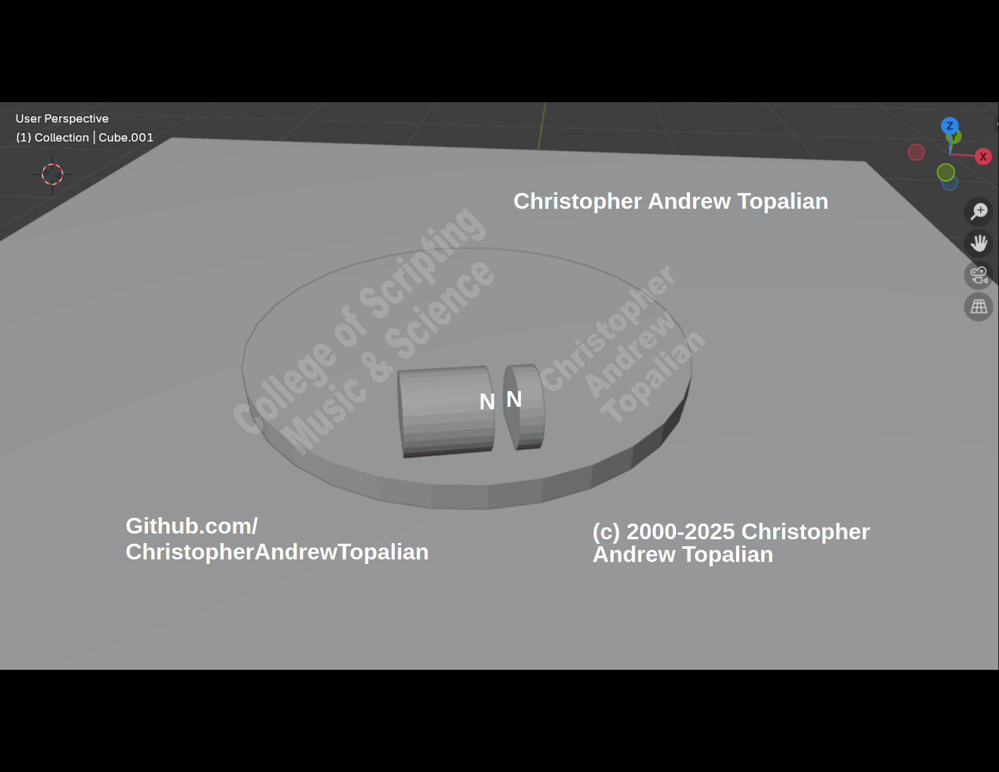

# CATopalian_Repulsion_Motor.md

Even though the big magnet is "stronger," the forces remain equal and opposite.

Why They Don't Just "Push in One Direction"
According to Newton's Third Law, the force the big magnet exerts on the small one is exactly the same as the force the small magnet exerts on the big one.

Imagine the big magnet as a giant wall and the small magnet as a person. If you (the person) push on the wall with 10 lbs of force, the wall pushes back on you with exactly 10 lbs.

Even if the big magnet has a massive field, it can only interact with the small magnet's field as much as that small magnet allows. It's a "handshake" - you can only squeeze a hand as hard as the other person's hand is there to be squeezed.

The Real-World Result
If you hold them North-to-North on your spinning platform:

Equal Repulsion: Both feel the same "push" (e.g., 5 Newtons of force).

Unequal Acceleration: Because the smaller magnet is lighter, that same 5 Newtons of force will make it fly away much faster than the big heavy magnet.

Rotation: On a spinning platform, they won't just push away; they will try to rotate so their opposite poles (North to South) can snap together. This is the "lowest energy state" they are constantly hunting for.

//----//

// Dedicated to God the Father  
// All Rights Reserved Christopher Andrew Topalian Copyright 2000-2025  
// https://github.com/ChristopherTopalian  
// https://github.com/ChristopherAndrewTopalian  
// https://sites.google.com/view/CollegeOfScripting  
College of Scripting Music & Science

